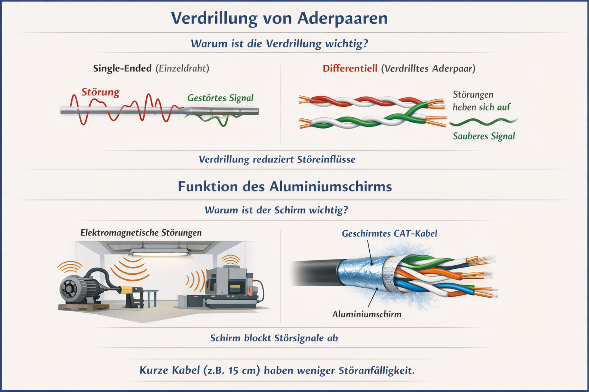

# 1. Warum ist die Verdrillung der Aderpaare so entscheidend?
Problem ohne Verdrillung (parallel geführte Einzeladern)
Bei parallel geführten Leitungen wirken die Adern wie Antennen:

Sie fangen elektromagnetische Störungen aus der Umgebung ein (Motoren, Leuchtstoffröhren, Schaltnetzteile).
Jede Ader nimmt unterschiedlich starke Störungen auf.
Das digitale Signal wird verfälscht → Bitfehler, Synchronisationsverlust.

Lösung: Verdrillte Adernpaare (Twisted Pair)
Ethernet arbeitet differenziell:

Ein Signal wird gleichzeitig positiv und negativ auf zwei Adern gesendet.
Durch die regelmäßige Verdrillung:

liegen beide Adern immer wieder abwechselnd näher an einer Störquelle,
die eingekoppelte Störung ist auf beiden Drähten nahezu gleich groß.

## Physikalischer Effekt:
Am Empfänger werden die beiden Signale voneinander subtrahiert.

Nutzsignal bleibt übrig
Störung hebt sich auf (Gleichtaktunterdrückung / Common Mode Rejection)

Ohne Verdrillung funktioniert dieses Prinzip nicht → das Ethernet‑Signal bricht zusammen, besonders bei 15 m und CAT‑6‑Frequenzen (bis 250 MHz).

# 2. Welche Funktion hat der Aluminiumschirm (z. B. S/FTP)?
Aufgabe des Aluminiumschirms
Der Schirm wirkt wie ein Faradayscher Käfig und hat zwei Hauptfunktionen:
## Schutz vor externen Störungen (EMI):

Elektromotoren
Förderbänder
Gabelstapler
Schweißgeräte
Schaltnetzteile

## Verhinderung eigener Abstrahlung:

Das Kabel selbst sendet weniger Störungen aus
Wichtig bei paralleler Verlegung zu anderen Daten‑ oder Stromleitungen

Warum ist das im Lager besonders kritisch?
In Lagerhallen gibt es:

hohe Anlaufströme
starke Magnetfelder
lange Kabeltrassen

## Ungeschirmtes Kabel + keine Verdrillung = maximale Störanfälligkeit
Das Signal erreicht den Access Point zwar elektrisch, aber logisch unlesbar → der Tester zeigt „Fehler auf Layer 1“.

# 3. Skizze: Single‑Ended vs. differentiell
(Die Grafik oben kannst du direkt für Präsentation oder Prüfungserklärung verwenden.)
Kernaussage der Skizze:

Einzelader: Störung verändert das Signal direkt
Verdrilltes Aderpaar: Störung wirkt auf beide Adern gleich → wird herausgerechnet

# 4. Warum hätte ein 15‑cm‑Kabel evtl. trotzdem funktioniert?
Bei nur 15 cm Kabellänge:

ist die Antennenwirkung minimal,
koppeln kaum externe Störungen ein,
die Signalform bleibt trotz schlechter Kabelgeometrie noch ausreichend sauber.

## Kurz gesagt:
Je kürzer das Kabel, desto geringer die Störeinflüsse – bei 15 m sind Verdrillung und Schirm aber zwingend notwendig.

# Merksatz (IHK‑tauglich)

Verdrillung kompensiert elektromagnetische Störungen durch differentielle Signalübertragung, während der Aluminiumschirm externe Störeinflüsse abschirmt – beides ist bei längeren CAT‑Kabeln für eine fehlerfreie Übertragung auf OSI‑Schicht 1 unerlässlich.

# examensgerecht in 6–8 Stichpunkten (IHK‑Niveau):

- Ethernet nutzt differentielle Signalübertragung, bei der ein Signal über zwei verdrillte Adern gesendet wird.
- Die Verdrillung der Aderpaare sorgt dafür, dass elektromagnetische Störungen auf beide Adern nahezu gleich einwirken.
- Diese gleichartigen Störungen heben sich am Empfänger durch Differenzbildung (Gleichtaktunterdrückung) auf.
- Parallel geführte Einzeladern wirken dagegen wie Antennen und nehmen Störungen ungleichmäßig auf.
- Der Aluminiumschirm eines CAT‑Kabels schützt die Adern vor externen elektromagnetischen Einflüssen (EMI).
- Besonders in Lagerhallen mit Motoren und Maschinen ist Abschirmung wichtig, um Signalverfälschungen zu verhindern.
- Ohne Verdrillung und Schirmung ist bei längeren Kabeln keine zuverlässige Übertragung auf OSI‑Schicht 1 möglich.
