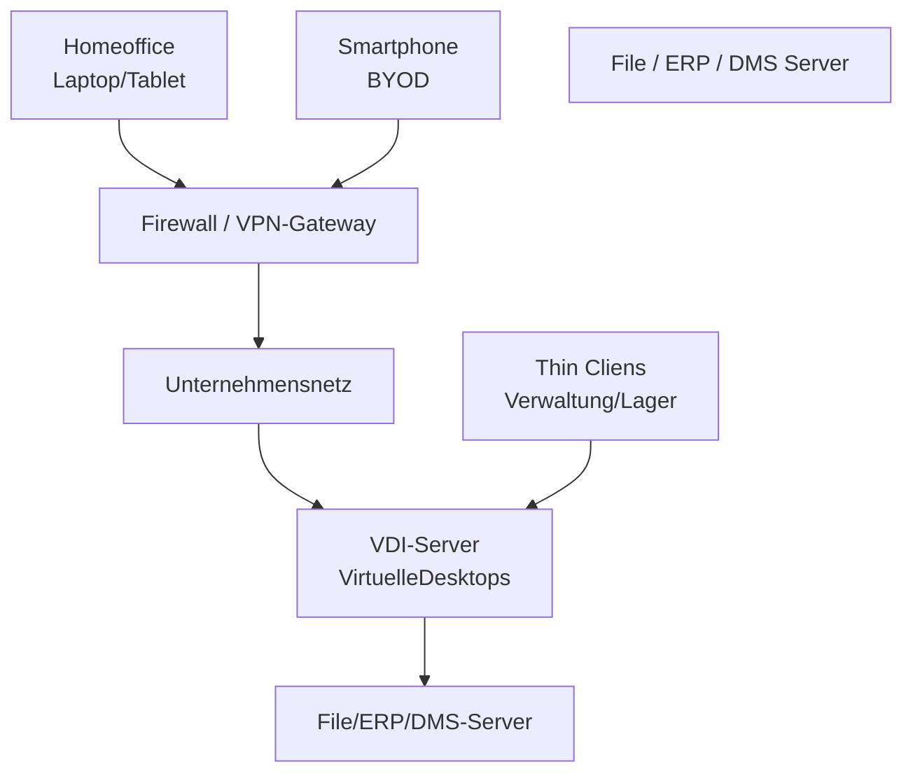

## IT‑Konzept: Remote‑Arbeitsplätze & Arbeitsplatzvielfalt
### Klemmbausteine GmbH – Kundenprojekte JuJ & Superlecker OHG

---

### 1. Projektübersicht und Zielsetzung

Im Rahmen mehrerer Beratungsaufträge soll die Klemmbausteine GmbH zwei unterschiedliche Unternehmen bei der Modernisierung ihrer IT‑Arbeitsplätze unterstützen.

Ziel ist es, **sichere, wirtschaftliche und zukunftsfähige Nutzungskonzepte** zu entwickeln, die sowohl **technische**, **organisatorische** als auch **rechtliche Anforderungen** berücksichtigen. Dabei liegt der Fokus auf Remote‑Zugriff, Arbeitsplatzvielfalt, Thin‑Client‑Konzepten sowie der Absicherung von BYOD‑Szenarien.

> **Profi‑Hinweis:**  
> Gute IT‑Konzepte trennen immer **Technik**, **Organisation** und **Recht** – das erwarten Prüfer explizit.

---

## Teil 1: Sicherer Remote‑Zugriff – JuJ Architekturbüro

### 1.1 Ausgangssituation

Das Architekturbüro Johann und Johann (JuJ) beschäftigt 12 Mitarbeiter.  
Die bestehende IT‑Infrastruktur wird überwiegend **On‑Premises** betrieben und umfasst unter anderem:
- Dateiserver
- Netzwerklaufwerke
- Dokumentenmanagementsysteme

Zukünftig sollen die Mitarbeiter **bis zu drei Tage pro Woche im Homeoffice** arbeiten können. Der Zugriff auf die internen Systeme ist dabei zwingend erforderlich und darf **ausschließlich autorisierten Mitarbeitern** ermöglicht werden.

---

### 1.2 Typische Technologien für sicheren Remote‑Zugriff

#### 1.2.1 VPN (Virtual Private Network)

Ein VPN stellt einen **verschlüsselten Tunnel** zwischen dem Endgerät des Mitarbeiters und dem Firmennetzwerk her. Der Benutzer arbeitet logisch so, als befände er sich im internen Netzwerk.

**Beispiele:**
- Open Source: WireGuard, OpenVPN
- Kommerziell: Sophos VPN, FortiClient

**Sicherheitsmechanismen:**
- Verschlüsselung (z. B. AES)
- Authentifizierung (Zertifikate, Benutzer/Passwort)
- Zugriffsbeschränkung auf definierte Netzbereiche

**Bewertung Nutzerfreundlichkeit:** hoch (nach kurzer Einweisung)

> **Profi‑Hinweis:**  
> VPN ist die **Standardlösung im KMU‑Umfeld**, weil sie günstig, bewährt und gut skalierbar ist.

---

#### 1.2.2 Remote Desktop / Terminalserver

Bei dieser Lösung greifen Mitarbeiter auf **zentrale Arbeitsplätze oder Server‑Desktops** zu. Die eigentliche Verarbeitung erfolgt im Unternehmensnetzwerk.

**Beispiele:**
- Microsoft Remote Desktop Services
- Open Source: Apache Guacamole

**Vorteile:**
- Keine lokalen Firmendaten auf Privatgeräten
- Zentrale Kontrolle und einfache Datensicherung

**Nachteile:**
- Hohe Abhängigkeit von Internetverbindung und Serverleistung

---

#### 1.2.3 Cloud‑basierte Zugriffsmodelle

Daten und Anwendungen werden teilweise oder vollständig in die Cloud ausgelagert.

**Beispiele:**
- Nextcloud (Open Source)
- Microsoft 365 / SharePoint

**Bewertung:**  
Für JuJ eher **ergänzend**, da bestehende On‑Prem‑Strukturen weitergenutzt werden sollen.

---

#### 1.3 Gesamtempfehlung für JuJ

✅ VPN als Hauptzugang (Open Source möglich)  
✅ Optional Remote Desktop für sensible Anwendungen  
✅ Geringe Kosten, hohe Sicherheit, überschaubarer Schulungsaufwand

---

### Teil 2: Arbeitsplatzvielfalt & Nutzungskonzepte – Superlecker OHG

#### 2.1 Zielsetzung

Die Superlecker OHG möchte ihre IT‑Arbeitsplätze modernisieren und verschiedene Endgeräte sowie Nutzungskonzepte evaluieren. Ein einheitliches Arbeitsplatzmodell für alle Mitarbeiter wird bewusst vermieden.

---

#### 2.2 Endgeräte und Einsatzbereiche

| Gerätetyp | Typischer Einsatz | Vorteil |
|---------|------------------|--------|
| Desktop / Tower‑PC | Verwaltung, Marketing | Hohe Leistung |
| Thin Client | Verwaltung, Kasse | Geringe Kosten |
| Laptop / Tablet | Außendienst | Mobilität |
| Embedded Systeme | Lager, Produktion | Spezialfunktionen |

---

#### 2.3 Fat Client vs. Thin Client

**Fat Client**
- Lokale Rechenleistung
- Geeignet für rechenintensive Software (z. B. Grafik, CAD)
- Höhere Anschaffungs‑ und Energiekosten

**Thin Client**
- Zentrale Rechenleistung (VDI / Server)
- Geringer Stromverbrauch
- Längere Lebensdauer

> **Merksatz (Prüfung):**  
> *Fat Clients rechnen lokal – Thin Clients rechnen zentral.*

---

#### 2.4 BYOD (Bring Your Own Device)

##### Chancen
- Geringere Hardwarekosten
- Hohe Mitarbeiterakzeptanz

##### Risiken
- Unterschiedliche Betriebssysteme
- Höherer Supportaufwand
- Datenschutzrisiken

> **Profi‑Hinweis:**  
> BYOD ist **kein Sparmodell**, sondern ein **Management‑Modell** – ohne klare Regeln wird es teuer.

---

#### 2.5 Bedarfsmatrix (inkl. TCO)

| Bereich | Hardware | Client‑Typ | Begründung |
|-------|--------|-----------|-----------|
| Produktion / Lager | Thin Clients, Terminals | Thin | Geringe Rechenlast |
| Zentralverwaltung | Desktop‑PCs | Fat | ERP, Office |
| Außendienst | Laptop / Smartphone | Fat / BYOD | Mobilität |

---

#### 2.6 Umweltaspekt (Green IT)

- ✅ Thin Clients: niedriger Energieverbrauch, lange Lebensdauer
- ❌ Fat Clients: höherer Stromverbrauch, kürzere Nutzungsdauer

---

### Teil 3: Technisches Sicherheits‑ und Verwaltungskonzept

#### 3.1 VDI‑Architektur (Virtual Desktop Infrastructure)

**Funktionsweise:**
- Virtuelle Desktops laufen zentral auf Servern
- Endgeräte dienen nur zur Anzeige und Eingabe

**Rolle des Netzwerks:**
- Hohe Bandbreite
- Geringe Latenz
- Hohe Verfügbarkeit

> **Profi‑Hinweis:**  
> VDI scheitert selten an Servern – meist am Netzwerk.

---

#### 3.2 MDM / UEM zur Absicherung von BYOD

**Ziel:** Trennung privater und geschäftlicher Daten

**Funktionen:**
- Geräteeinschreibung
- Verschlüsselung
- App‑Container
- Fernlöschung bei Verlust

**Beispiele:**
- Microsoft Intune
- VMware Workspace ONE

---

### 3.3 Rechtlicher Rahmen – BYOD‑Nutzungsvereinbarung

**Zwingende Inhalte:**
- Update‑ und Sicherheitspflichten
- Trennung privater / geschäftlicher Daten
- Fernlöschung bei Geräteverlust
- DSGVO‑konforme Verarbeitung

---

### 4. Gesamtfazit

Durch die Kombination aus **VPN, VDI, Thin Clients und MDM** entsteht eine sichere, wirtschaftliche und skalierbare IT‑Arbeitsplatzstrategie. Unterschiedliche Nutzungskonzepte je Unternehmensbereich ermöglichen eine optimale Balance zwischen Kosten, Sicherheit und Benutzerfreundlichkeit.

> **Prüfungs‑Merksatz:**  
> *Nicht die Technik ist entscheidend, sondern das passende Konzept pro Nutzergruppe.*

---

---

> **🎤 20‑Sekunden‑Prüfungserklärung (passend zum Diagramm)**

> **Externe Mitarbeiter greifen über ein VPN auf das Unternehmensnetz zu, arbeiten dort auf virtuellen Desktops, und alle Firmendaten bleiben zentral auf den Servern, während BYOD‑Geräte zusätzlich über MDM abgesichert werden.**

---
