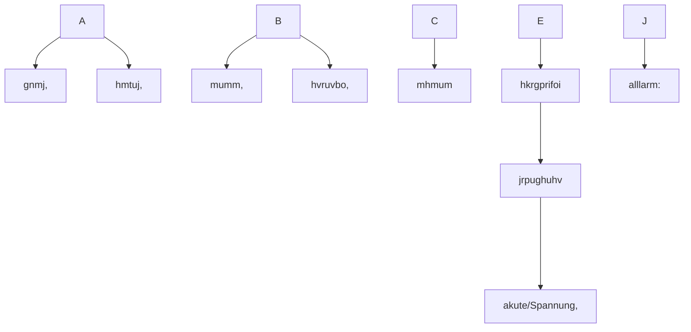
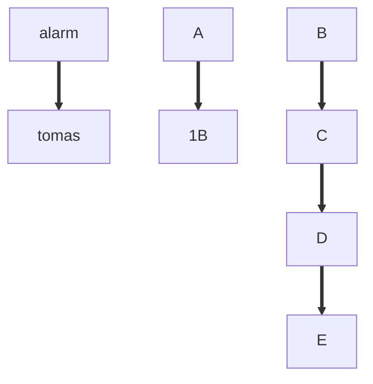
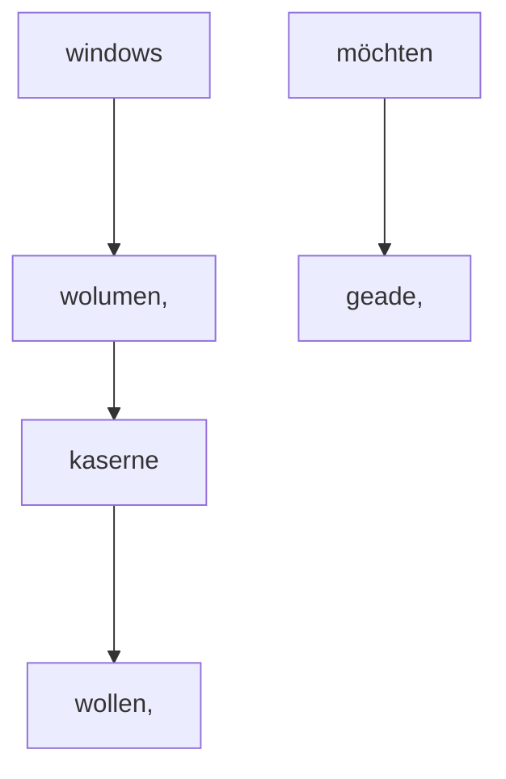
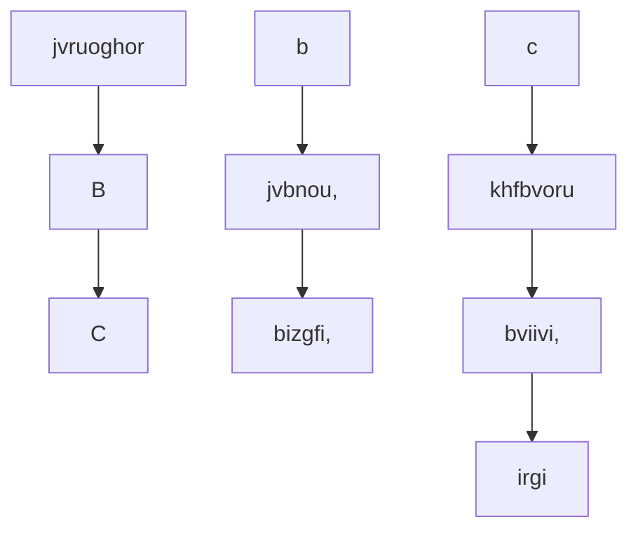
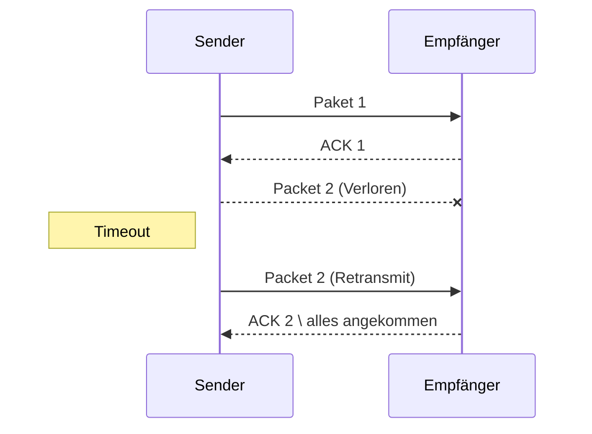
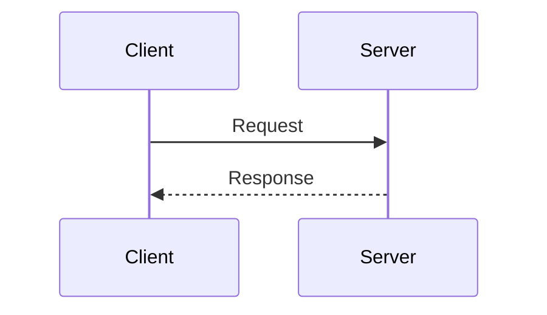
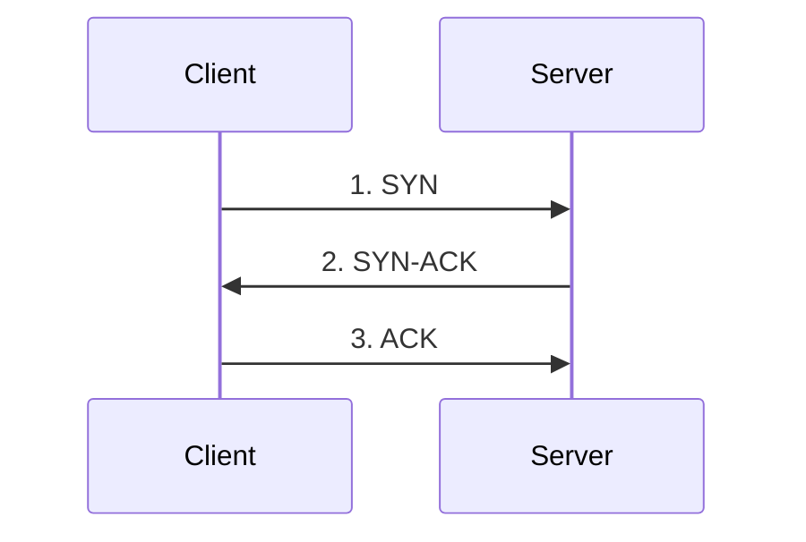
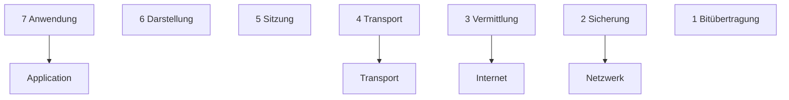
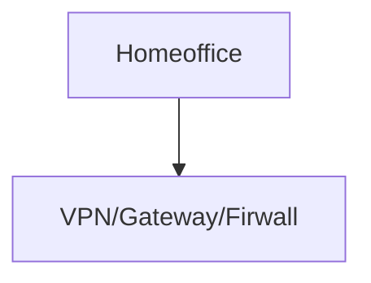

::: mermaid
graph TD;
    A-->lB;
    A-->C;
    B-->D;
    C-->D;
:::

```mermaid
architecture-beta
    service user(mdi:account)
    service lambda(logos:aws-lambda)

    user:R --> L:lambda
```

Configures the Mermaid theme used when VS Code is using a light color theme. Supported values:

---

Supported Diagrams
Currently supported diagrams and charts:

Flowchart
Sequence
Block
Class
Entity Relationship
Gantt
Mindmap
State
Timeline
Gitgraph
C4
Sankey
Pie chart
Quadrant
Requirement
User Journey
Sankey
XY chart
Kanban
Architecture
Packet
Radar

---